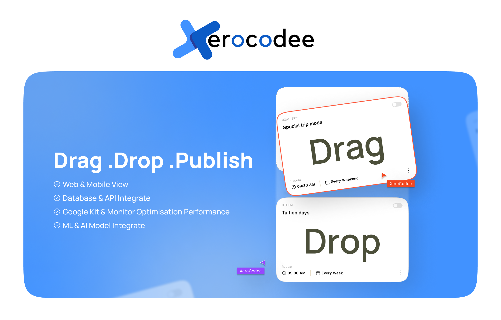

# Overview

**XeroCodee** is a SaaS product that gives its users a platform to construct a page by dragging and dropping unique UI elements, with the ability to export the design to four other frameworks while also lowering the cost due to the microservices we've employed. Connect to your databases and APIs, design UIs with drag-and-drop building elements like tables and forms, and write SQL and JavaScript queries to interact with data.

<figure><figcaption></figcaption></figure>

### **What is XeroCodee?**

**XeroCodee** is an open-source low-code platform that allows developers to design and deploy applications in record time.

You may quickly connect to multiple data sources with **XeroCodee**, including databases, API/GraphQL endpoints, SaaS applications, and cloud storage services. Popular choices include PostgreSQL, MongoDB, MySQL, Stripe, Google Sheets, and AWS S3. After connecting to these sources, XeroCodee may perform queries to get and update data. Tables, charts, and forms are among the user interface (UI) components that make it easy to visualise and edit data.

With **XeroCodee**, you can quickly and simply create a user interface (UI) by dragging and dropping pre-built widgets onto a grid-style canvas. This streamlines the integration of your application's front-end and back-end and optimises the development process. Furthermore, JavaScript is supported within widgets, queries, and other components of **XeroCodee**, allowing you to add logic, alter data, and design complicated processes. This makes it simple to tailor your application to your individual requirements.

**UNIQUE FEATURES**

Some of the unique features of our app are:

* One can get completely reusable code for websites in both **Web & Mobile views**.
* One can choose any **database/API** of their choice and integrate without writing a single word of code.
* One can link their website with **google kits** and can **monitor optimisation performance**.
