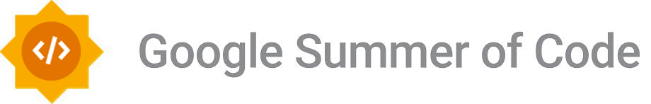

# Google Summer of Code 2023

<figure><figcaption></figcaption></figure>

XeroCodee plans to apply as a Google Summer of Code mentoring organisation in 2023. We are thrilled to be a part of this 19-year-old initiative, which will bring in a new generation of open-source developers and enthusiasts.

Almost anybody [over 18](https://opensource.googleblog.com/2021/11/expanding-google-summer-of-code-in-2022.html) who enjoys coding and wants to learn more about the fantastic world of open source is welcome to join us as a GSoC 2023 contributor.

Please visit the [GSoC 2023 Official Website](https://summerofcode.withgoogle.com) for more information and guidelines about Google Summer of Code 2023. For additional information about the timeline, visit the [Official Google Summer of Code 2023 Timeline](https://developers.google.com/open-source/gsoc/timeline).

****

****
